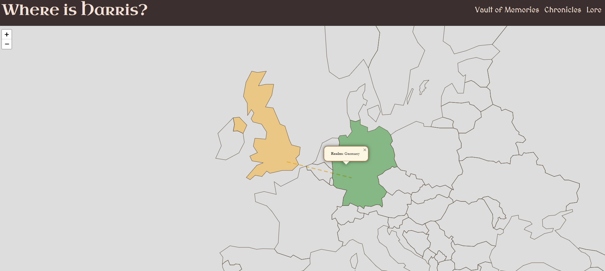

# where-is-harris

Travel Tracker and Photo Journal (WIP)

This is a work-in-progress full-stack web application that allows one person to track a friend’s real-time travel location and upload photos from their journey. It includes a live GPS map, a photo gallery, and room for future enhancements like travel notes or tagging.

The project is ideal for following a friend or loved one as they travel through regions such as Europe and South America.

## Features

- Live Location Tracking:
  - View your friend's current location on a map.
  - Location updates are handled via browser GPS or a GPS-tracking mobile app.

- Photo Upload and Gallery:
  - Upload and store images from the trip.
  - View uploaded images in a basic gallery grid.

- Backend API:
  - Built using Python and Flask.
  - Handles GPS updates, image uploads, and serves uploaded content.

### Planned Features

- User authentication for uploading access
- Historical route tracking on the map (polylines)
- Location-tagged photos and notes
- Travel stories and metadata per image
- Cloud-based storage integration (S3, Firebase)
- Mobile-optimized UI

## How to Run Locally

### Requirements

- Python 3.7 or higher
- pip (Python package installer)

## Example Workflow

1. Your friend updates their location using:
   - A webpage with browser GPS tracking, or
   - A mobile app like OwnTracks configured to send GPS data to your backend.

2. Your friend uploads photos through the photo upload page.

3. You or any viewer can:
   - Check the live map to see their current location.
   - View a gallery of uploaded travel photos.

## License

This project is licensed under the MIT License. You are free to use, modify, and distribute it.

## Contribution and Feedback

This project is actively being developed. Feedback and contributions are welcome. Please open an issue or submit a pull request if you'd like to help improve it.

